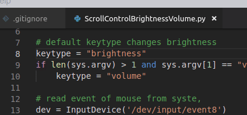

# Brightness And Volume Scroller

A plugin for [Budgie HotCornersII](https://github.com/UbuntuBudgie/budgie-extras/tree/master/budgie-hotcorners) to change screen brightness or volume.

---

- Uses `xdotool` to send function keys.
- Uses `evdev` to read mouse events.

## Features

- Changes screen brightness by scrolling mouse wheel.
- Changes volume by scrolling mouse wheel.
- Auto-closes when mouse leaves a corner.

## Install

- I'm not a professional linux developer. I made this and it works on my Ubuntu Budgie 18.04 Bionic.
- Install [python3-evdev](https://github.com/gvalkov/python-evdev):
-      sudo apt install python3-evdev
- Download or clone this repository.
- Find your mouse event file by running:
-     sudo cat /proc/bus/input/devices
- Change `mouseEvent` variable to your path of mouse event.
- Add this script path to [Budgie HotCornersII](https://github.com/UbuntuBudgie/budgie-extras/tree/master/budgie-hotcorners)

## References

[Ubuntu Budgie](https://ubuntubudgie.org/) 
[XF86 keyboard symbols](http://wiki.linuxquestions.org/wiki/XF86_keyboard_symbols)  
[xdotool](http://manpages.ubuntu.com/manpages/bionic/man1/xdotool.1.html)